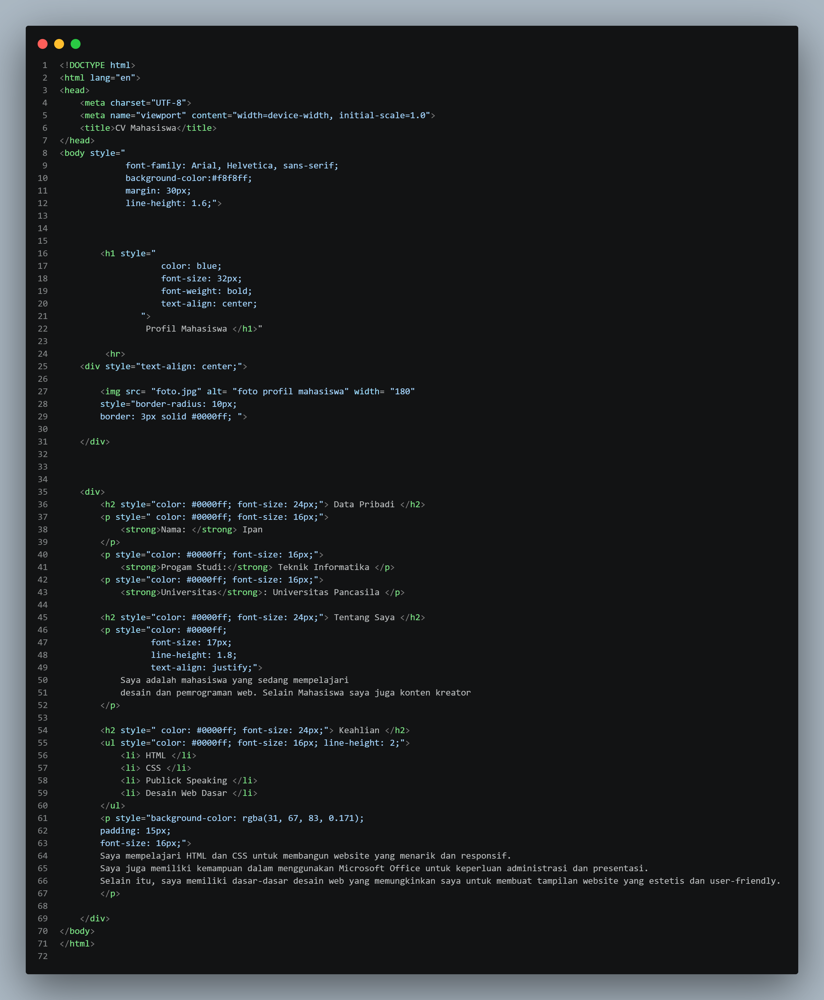
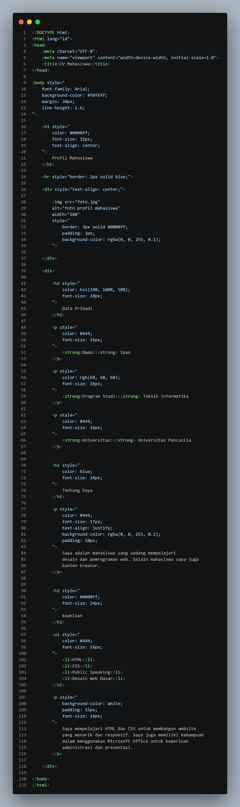

# Tugas Praktikum Pertemuan 3

## Tugas Individu

Modifikasi profil mahasiswa pada HTML menggunakan minimal 10 property CSS Inline dan 4 format warna yang berbeda.

## 1. Deskripsi

Pada tugas ini saya memperbaiki dan memodifikasi halaman profil mahasiswa menggunakan CSS Inline. Semua perubahan ditulis langsung pada atribut `style` di dalam HTML tanpa membuat file CSS terpisah.

Tujuan perubahan adalah membuat tampilan profil lebih rapi, nyaman dibaca, dan konsisten dengan tema warna biru.

File yang digunakan:

| File | Keterangan |
|---|---|
| `index.html` | Versi sebelum perubahan |
| `index2.html` | Versi sesudah perubahan |

## 2. Perubahan yang Dilakukan

Perubahan dari `index.html` ke `index2.html`:

1. Mengubah warna background halaman dari `#f8f8ff` menjadi `#f0f6ff` (biru muda).
2. Memberi gaya pada garis `
` menjadi `border: 2px solid blue`.
3. Menambahkan `padding` dan `background-color` transparan pada foto.
4. Mengubah warna teks Data Pribadi dan Keahlian dari biru menjadi abu-abu gelap (`#444` dan `rgb(68, 68, 68)`) agar lebih mudah dibaca. Judul tetap biru.
5. Mengubah warna judul bagian "Data Pribadi" memakai format HSL.
6. Menambahkan `background-color` biru transparan dan `padding` pada bagian "Tentang Saya".
7. Mengubah background paragraf terakhir menjadi putih dan merapikan isinya.
8. Memperbaiki kesalahan penulisan: "Progam Studi" menjadi "Program Studi", "Publick Speaking" menjadi "Public Speaking", serta tanda kutip `"` yang tidak sengaja muncul setelah `</h1>`.
9. Mengubah `lang="en"` menjadi `lang="id"` karena isi halaman berbahasa Indonesia.

## 3. CSS Inline yang Digunakan

Property CSS pada `index2.html`:

- `font-family`
- `background-color`
- `margin`
- `line-height`
- `color`
- `font-size`
- `text-align`
- `border`
- `padding`

Property tambahan yang dipakai pada `index.html`: `font-weight` dan `border-radius`.

Semua property ditulis langsung pada atribut `style`, sehingga tidak menggunakan file CSS terpisah.

## 4. Format Warna

Dalam kode `index2.html` digunakan 5 format warna yang berbeda:

| Format | Contoh | Digunakan pada |
|---|---|---|
| Name | `blue`, `white` | Garis `
`, judul "Tentang Saya", paragraf terakhir |
| HEX | `#0000ff`, `#f0f6ff`, `#444` | Judul, background halaman, teks |
| RGB | `rgb(68, 68, 68)` | Teks Program Studi |
| RGBA | `rgba(0, 0, 255, 0.1)` | Background foto dan "Tentang Saya" |
| HSL | `hsl(240, 100%, 50%)` | Judul "Data Pribadi" |

## 5. Dokumentasi Sebelum

Berikut adalah screenshot kode sebelum dilakukan perubahan (`index.html`).

## 6. Dokumentasi Sesudah

Berikut adalah screenshot kode setelah dilakukan perubahan (`index2.html`).

## 7. Masalah dan Solusi

**Masalah 1:** Seluruh teks pada `index.html` berwarna biru `#0000ff`, sehingga kurang nyaman dibaca dan tidak ada pembeda antara judul dan isi.

**Solusi:** Judul tetap biru, sedangkan isi teks diganti abu-abu gelap (`#444`).

**Masalah 2:** Terdapat tanda kutip `"` yang tampil di halaman karena salah ketik setelah `</h1>`, serta salah ketik pada "Progam" dan "Publick".

**Solusi:** Tanda kutip dihapus dan ejaan diperbaiki.

**Masalah 3:** Saat penulisan, muncul kesalahan sintaks pada CSS Inline: nilai warna ditulis ganda (contoh `blue (255, 105, 180)` dan `#0000ff(330, 100%, 70%)`) serta kurang tanda titik koma pada `border: 3px solid #0000ff`. Akibatnya property setelahnya tidak terbaca browser.

**Solusi:** Setiap property diberi satu nilai warna yang valid dan diakhiri titik koma.

**Masalah 4:** Foto tidak tampil jika `foto.jpg` tidak berada dalam folder yang sama dengan file HTML.

**Solusi:** File `foto.jpg` diletakkan satu folder dengan `index.html` dan `index2.html`.

## 8. Kesimpulan

Dari praktikum ini saya memahami cara menggunakan CSS Inline untuk mengubah tampilan HTML, termasuk pentingnya penulisan sintaks yang benar (titik koma dan satu nilai per property). Saya juga memahami perbedaan format warna Name, HEX, RGB, RGBA, dan HSL. CSS Inline praktis untuk perubahan cepat, tetapi gaya harus diulang pada setiap elemen sehingga kurang efisien untuk proyek besar.